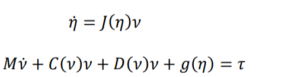

# Non_Linear_ROV_PID_MATLAB
Theory

The following is a team project and we aim at physical implementation of the following model (Non-linear) in future. The following content deals with building a PID based control system for a Remotely operated underwater vehicle(ROV). The main challenge in implementing this is because the bot will be prone to many non-linearities underwater. 

So, the basic mathematical model of an ROV is given by:

where:
- M = Mass matrix (with added mass effect taken into account)
- C = Coriolis force matrix
- D = Damping forces matrix
- g = Restoring forces matrix
- 𝜏 = Forces & moments matrix

1) **Added Mass Effect:**
The added mass of an object is the effect in which some mass of fluid surrounding the object under observation is accelerated/decelerated along with it.

2) **Coriolis Effect:**
The Coriolis force is a fictitious force that comes into play whenever we are trying to explain the forces on an object with respect to a rotating frame.

3) **Ziegler-Nichols Method for tuning PIDs:**
This method can be used to tune our PID both in the case where we have a working model for our plant or even when we don’t. The first step to this method is measuring two parameters: KU which is the gain at which the system becomes marginally stable and TU which is the period of oscillation at marginal system response. These values are found by taking KI and KD values to be zero for that input and changing KP until marginal stability is achieved.
After these parameters are evaluated controller gains can simply be calculated from the below table:

4) **Controller Models:**
The two controller models that we used are:
A. **Linear Model:**
Which is useless as we have tested in underwater autonomous working!!

B. **Non-Linear Model:**
Because of disturbances underwater like current speed, there will be non-linearities introduced into the system. This makes the linear-PID controller model inappropriate to use as there will be a lot of deviations from the desired o/p and noise in the system. So, we need to include the system dynamics to get the control input to the thrusters. 
In the nonlinear model-based PID control system design, the dynamic model of the ROV is utilized to produce a 6-DoF predictive force and the model-based PID is used to provide a corrective force in 6 DoFs to adjust the error in the model. This is advantageous in that the model error and nonlinearities tend to be smaller than the dynamics themselves.
In the predictive force generation, a virtual reference trajectory strategy is introduced for the design of trajectory tracking. With the use of a scalar measure of tracking in Fossen (Fossen, 1994), a virtual reference 𝑥𝑟 can be defined that satisfies:
𝑥𝑟_dot = 𝑥𝑑̇ _dot+ 𝜆𝑒𝑏

where 𝜆 > 0 is the control bandwidth that describes the amount of tracking error to the overall tracking performance, and 𝑒𝑏
is the tracking error in the body frame. 
Since the velocity 𝑣 is the time derivative of the position (i.e. 𝑣 = 𝜂̇), for a defined virtual reference position 𝜂𝑟, the following is satisfied:
𝑣𝑟 = 𝑣𝑑 + 𝜆𝑒b

So, lambda(𝜆) is used to tune the 6-DoF predictive force.
This is shown in the following block:

Where ‘A’ is the new controller output.

The PID controller gains(Kp, Ki and Kd) for the non-linear model are found out by Ziegler Nichols method and were found out to be as follows:

Finally, the control law for the nonlinear model-based PID controller is computed given by:

The final model for this system is shown below:

Here, we took desired position input as [1; 1; 2; 0; 0; 0].

## **Implementation:**
We implemented the models for both the controllers above and got the following results when we give a desired positional input:

**Non-Linear Controller Model:**
For desired positional input as [1; 1; 2; 0; 0; 0], we got the following results for positional coordinates in world frame:
**Position X :**
Desired output: 1 m

**Position Y :**
Desired output: 1 m

**Position Z :**
Desired output: 2 m

**Orientation 𝛷 :**
Desired output: 0 rad

**Orientation 𝛳 :**
Desired output: 0 rad

**Orientation 𝛹 :**
Desired output: 0 rad

The controller input plots (controller input for each thruster will be as follows):

So, we can see that the thrust control input for thrusters 5,6,7 and 8 will be: -1.375e-02, 1.375e-02, 1.375e-02, -1.375e-02 respectively.
Now, since propeller pair of 5 and 8 will be opposite to that of the pair 6 and 7, we get the total thrust on the ROV in Z-direction as:
1.375e-02*4*40 = 2N (approx.), where 40 is the gain. 
So, the force in the vertical direction is balanced.

The Non-linear model above is made as an extension to the linear model and its Simulink model is available in my Github Repository. 

For the above work, we referred to the following article:
- https://flex.flinders.edu.au/file/27aa0064-9de2-441c-8a17-655405d5fc2e/1/ThesisWu2018.pdf

---

The PID controller has been one of the most commonly used controllers for a really long time. There have been numerous PID tuning techniques, such as the Ziegler-Nichols method but are insufficient for high-performance control applications. The Linear Quadratic Regulator (LQR) is an optimal control method based on full state feedback. It aims to minimise the quadratic cost function and is then applied to linear systems, hence the name Linear Quadratic Regulator. 

---
